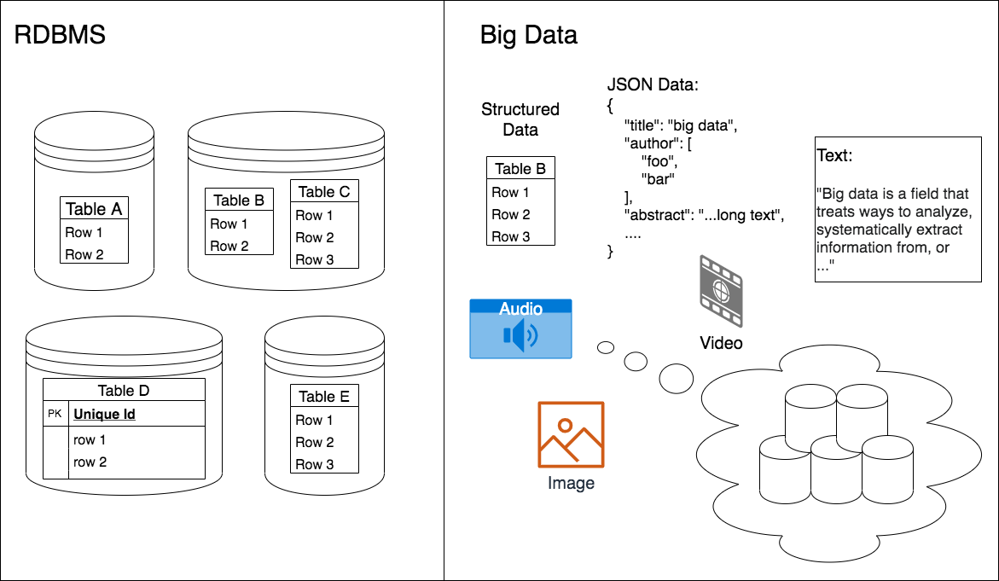

# Introduction

<!-- > /10 The introduction part should introduce the topic and its importance. It should also include at least one diagram related to the topic. One page is sufficient for this section. -->

<!-- ## ~~what is big data.~~ -->
In recent years, huge volumes of data have been generated by a variety of sources such as e-businesses, communications, mobile phones, social media sites, web servers, sensor networks, cameras, banks, stock markets, and so on [@OUSSOUS2018431; @SIVARAJAH2017]. Nowadays, data are being generated at an unprecedented rate, bringing us into an era of big data or "data deluge" [@SIVARAJAH2017; @hu2014]. The types of data vary from text to multimedia including image, audio and video, and the format can be structured, semi-structured and unstructured. In fact, more than 90% of the overall data generated in the real world are unstructured [@SIVARAJAH2017].

<!-- ## ~~value, importance~~ -->
Big data bears enormous potential values with the expectation of transforming the humans society, and is consequently regarded as the "new oil" by some researchers [@hu2014]. It does not only bring large amount of revenues to businesses and values to consumers, but also have great potential applications in a range of industries. For instance, health or medical data analysis has many advantages including personalised health service, disease evolution monitoring, and adaptive public health plans [@OUSSOUS2018431]. Another example is the real-time analysis of data generated by smart meters, sensors and control devices on smart grid, which can help in incident detection, risk identification, and energy consumption forecast [@OUSSOUS2018431]. In commercial environment, companies such as Google, Amazon, Facebook and Twitter have been greatly benefited from big data techniques and applications [@Hewage2018].

<!-- > "For instance, the opportunities include value creation (Brown, Chui, & Manyika, 2011), rich business intelligence for better- informed business decisions (Chen & Zhang, 2014), and support in enhancing the visibility and flexibility of supply chain and resource allocation (Kumar, Niu, & R ́, 2013). " [@SIVARAJAH2017] -->

<!-- ## ~~challenges, especially on scalability~~ -->
Before the big data revolution, it is difficult to store, manage or analyse datasets in large volumes because of the limited store capacity and lack of scalability, flexibility and performance in traditional technologies [@OUSSOUS2018431]. Relational database management system (RDBMS), the main technology in traditional data management, does not fit the requirements of big data analysis. The reasons of this mismatch are mainly twofold, that is:

- Data structure: RDBMS only supports structured data, while has little capability in storage and analysis of semi-structured and unstructured data [@hu2014].
- Scalability: RDBMS only scales up at high costs of hardware, and is very difficult to scale out, which makes it incapable in continuously growing data scenarios [@hu2014; @SIVARAJAH2017].

{#fig:compare}

A demonstration of difference between traditional RDBMS and big data technology is shown in Fig. @fig:compare .

<!-- ## ~~popularity~~ -->
As a response to the big values and big challenges inside big data, interests from both academia and industry are dramatically increasing in recent years. A wide range of issues have been studied at different levels including data storage, cleaning, analysis, visualisation, and so on, some of them still open to research [@OUSSOUS2018431]. In the industry, many companies have their own big data platforms, for example, Google's large data storage Google File System(GFS) and cloud based data management system Fusion Table [@Hewage2018]. Many big data systems and platforms including open-source ones have been being developed, for instance, NoSQL Databases, BigQuery, MapReduce, Hadoop, HiveQL, Spark, to mention but a few [@Hewage2018; @SIVARAJAH2017; @hu2014]. Some projects have also been launched by governments of countries such as USA and Japan to catch big data opportunities [@OUSSOUS2018431].

# Background 

<!-- > /10 Background is important to understand the topic in depth while motivation presents the importance of the topic statement of objectives; two themes identified for the report should be clearly stated. One page is sufficient for this section. -->

<!-- ## ~~in depth understanding of Big Data~~ -->

The main characteristics of big data are described as three Vs, namely Volume, Velocity and Variety [@OUSSOUS2018431; @hu2014]. First of all, the large volume of data is an essential difference between big data and traditional data [@hu2014]. Second, the velocity at which the data are being generated implies that the processing and analysis of datasets should be carried out at a comparable rate to the data production [@hu2014]. Third, big data are produced in various format including text and multimedia from various data sources, resulting in high heterogeneity and diversity [@OUSSOUS2018431; @Pouyanfar2018]. In addition to these three Vs, some researchers add "Value" to extend to a four Vs model [@hashem_rise_2015].

There are many types of data that big data analysis systems need to cope with. Web data is a common one important for search engines such as Google. Amazon has its shopping and transaction data, and Facebook and Twitter have a huge number of social media data including user profile and posts. Log file is also an important type of data that is generated by web service companies especially cloud-computing providers [@hu2014]. Wireless sensor networks is another important source of data, generating a variety of sensor data including sound, force, temperature, pressure, chemical, and so on [@hu2014]. Bioinformatics is another area benefited from big data analytics. For instance, a DNA sequence analysis system was built and deployed in the Amazon cloud, and another one for biological molecular analysis was constructed on top of Hadoop [@hashem_rise_2015]. Big data also advances some science areas which generates massive volume of data such as high energy physics and astronomy.

According to a well-accepted system engineering methodology in industry, the big data value chain is decomposed into four consecutive stages [@hu2014]:

- **Data generation** refers to the processes that data are generated from various sources. 
- **Data acquisition** focuses on the obtaining and collection of data.
- **Data storage** concerns the persistent data storage and effective data management. 
- **Data analytics** is the stage concerning the extraction of value from data by exploring, transforming, modelling and visualising data with analytical tools.

<!-- ## ~~motivation & importance of Big Data~~ -->

<!-- ## ~~challenges of opportunities of Big Data~~ -->

The mismatch between the requirements of big data and existing data management hardware and software platforms raises many challenges to both industry and research community. Many researches and practices, especially relating to the scalability, have been conducted among the four phases, including:

- Network architectures and protocols with high throughput, low latency and optimal energy consumption for large-scale data transmission [@hu2014]
- Scalable data cleaning, aggregation and duplication removal method for huge dataset at reasonable speed but still with acceptable accuracy. It is essential for big data quality and reliability [@hu2014; @OUSSOUS2018431]
- Infrastructures, file systems and database technologies for distributed and scalable data storage. More specific issues include data partitioning and replication scheme, scalable data indexing and query, CAP option (consistency, availability and partition tolerance), concurrency control mechanism, parallel and distributed programming model [@hu2014; @Gupta2016].
- Scalable machine learning on large dataset, including deep learning on large dataset, online (or stream) learning, parallel reinforcement learning, computational framework for machine learning, and so on [@OUSSOUS2018431; @Gupta2016]
- Real-time or near real-time analysis of large increasing volume of data [@OUSSOUS2018431]
- Imbalanced big data analysis [@OUSSOUS2018431]
- Big data visualisation [@hu2014]

<!-- ## ~~themes to dive in~~ -->

Given so many challenges in big data, this report will conduct dive deeper into detailed studies on the following themes: 1) big data indexing and retrieval; 2) big data infrastructure; 3) scalable data mining and machine learning.

<!-- - ~~Big Data visualisation~~ -->
<!-- - ~~specific issues for Big Data applications in different areas~~  -->

# Literature Review

<!-- > /15 Related work should comprise the review of current state of knowledge relevant to the topic. Comparison and contrasting between different authors/approaches should be a clear. Page length is 1 to 2. -->

<!-- reviews of surveys on Big Data -->

<!-- ~~reviews of publications on the themes~~ -->

## Big Data Indexing

While the volume of data is growing explosively and unstructured contents are gaining dramatically increasing weight in the overall data, existing data indexing strategies, mainly designed for RDBMS, do not satisfies the requirement for efficient retrieval and querying of huge amount of heterogeneous data[@gani2016; @Pouyanfar2018]. As a result, many indexing algorithms have been proposed as responses to this challenge. In general, indexing strategies can be put into three categories: non-Artificial Intelligence (NAI), Artificial Intelligence (AI), and Collaborative Artificial Intelligence (CAI) approaches [@gani2016; @Pouyanfar2018].

NAI approaches include tree-based (B\textsuperscript{+}-tree, R-tree and X-tree), bitmap-based and hash-based methods [@gani2016]. @lu2014 proposed ScalaGiST, a scalable generalised search tree, for distributed data indexing working seamlessly with the open-source MapReduce system of Hadoop. It can be easily implemented with widely-used B\textsuperscript{+}-tree and R-tree, and supports not only conventional query but also multi-dimensional range and similarity queries. The author also demonstrated the dynamic deployment to large Hadoop clusters to cope with large number of users and huge volume of data [@lu2014]. 

@ma2017 proposed an in-memory distributed indexing method benefited from Apache Spark system for large-scale media data searching. The author created feature vectors for each data, and built M-trees for indexing on each computing node. The local indexing method is claimed to be replaceable by any other tree-based or hash-based indexing structure. Over 30x speed-up was gained by this system in the experiments.

@xie2019 proposed a novel indexing approach, called COordinate-based INdexing (COIN), for data sharing in edge computing environment. Unlike the mainly master/slave-architectured cloud computing systems, edge computing ones are working in a more peer-to-peer way. COIN models the network topology in a virtual 2-dimensional (2-D) coordinate system, maps a data index into this 2-D space by a hash function, and forwards a data index to an edge node closest to the coordinate of this data index. The experiments on a real network and simulation on large-scale network showed that COIN has shorter average path length and less number of forwarding entries than the DHT method which has been widely studied and applied in real world distributed systems.

@Wang_2016 conducted a comprehensive survey on hash-based big data indexing methods with learnable hash functions. Locality Sensitive Hashing (LSH) refers to a specific kind of hashing methods which are more likely to generate closer hash codes (that is, more bits are the same) of two data points if they have higher similarity in the original space, which is consequently an ideal method for approximate nearest neighbour (ANN) search. The hash function can be data-dependent, which is adjusted to the target data by machine learning algorithms to maximise the indexing performance. For example, some algorithms such as Spectral Hashing learns hash functions to make the data more balanced.

## Big Data Infrastructures

Big data infrastructures such as MapReduce and Spark play important role in scalable big data analysis because it handles the intensive and repetitive underlying works such as data distribution, replication, resource allocation and fault-tolerance for programmers [@Gupta2016]. A large number of big data infrastructures, usually including distributed file system (DFS), database and computational frameworks, have been proposed and developed in industrial settings by open-source foundations and companies such as Amazon, Facebook, Google, Twitter, and so forth [@Gupta2016; @Hewage2018].

### Distributed File System

DFS provides scalable and reliable data storage via distribution and replication of data blocks across a collection of interconnected machines [@Gupta2016]. As an successful example in industry, Google developed its DFS solution named Google File System (GFS), the largest DFS cluster in the world [@Hewage2018]. Other companies also developed own cloud-based big data storage, such as Microsoft's Azure and Amazon's S3 [@hashem_rise_2015]. There are also several open-source solutions for DFS, among which HDFS is the most widely used one, and Ceph, GlusterFS and XtreemFS are some other alternatives [@Gupta2016].

### Data Model

Novel data models and database technologies are required for big data due to the lack of scalability of traditional RDBMS [@Gupta2016]. Two main categories of big data models are Not Only SQL (NoSQL) and NewSQL.

#### NoSQL

While RDBMS rigorously complies with ACID principle (Atomicity, Consistence, Isolation, Durability), NoSQL databases focus on horizontal scalability and availability, and comply with BASE properties (Basically Available, Soft-state, Eventually consistent) [@Gupta2016]. There are four categories of NoSQL models which is adopted by a variety of researches [@grolinger_data_2013; @hashem_rise_2015; @Gupta2016; @hu2014]:

- Key-value store: In such a system, data are stored as values associated with keys, and can be accessed only by exact match with keys, which resembles a dictionary or associative map. It is appropriate for fast equality query, for example, retrieving user profile by its ID. For example, Amazon builds its own key-value storage system Dynamo [@Hewage2018]. Some other typical systems are Memcached, Redis, Voldemort, BerkeleyDB, and Riak [@grolinger_data_2013].
- Column-family store: It stores data in a column-oriented structure which is similar to rational databases. However, unlike RDBMS, it stores data in distributed manner and does not require pre-defined table schema. It is pioneered by Google's BigTable which eventually becomes an ancestor of most other column-family store systems. HBase as part of Hadoop ecosystem is an open-source implementation of BigTable concepts. Some other well-known systems includes Facebook's Cassandra and Amazon's SimpleDB and DynamoDB [@grolinger_data_2013; @hu2014].
- Document-oriented store: These systems model data as documents in some kind of standard data exchange format, most of them JSON (JavaScript Object Notation) or its variations [@grolinger_data_2013]. Different documents do not necessarily contain the same attributes, thus providing a schema-free storage. Some representatives are CouchDB and MongoDB [@Gupta2016].
- Graph database: It stores data as graphs containing vertices (or nodes) and edges (or links) with associated properties, thus is suitable for data with extensive interconnections [@grolinger_data_2013]. Some typical systems are Neo4j, InfoGrid, and GraphDB [@Gupta2016].

#### NewSQL

NewSQL is an alternative of big data models, also known as next generation solutions for scalable RDBMS, which combines the advantages of both RDBMS and NoSQL. Specifically, it provides the scalability of NoSQL systems without sacrificing the ACID properties of rational databases [@Gupta2016]. Some representatives are NuoDB and VoltDB [@Gupta2016]. Spanner, developed by Google, is seen as a NewSQL database over the cluster distributed globally [@grolinger_data_2013; @hu2014]. F1, also by Google and build upon Spanner, implements many RDBMS-like features such as strict schema along with high scalability such as dynamic sharding and consistent replication. It is backing Google's advertisement business [@hu2014].

### Distributed Computational Framework

Computational framework is another important part of big data infrastructure, which can be categorised into three modes: batch mode, real-time, and hybrid mode [@Gupta2016]. 

#### Batch Mode

In batch mode, data to be proceeded are divided into batches which are computed in parallel across a cluster of nodes. The most well-known batch mode distributed processing framework is MapReduce, which basically consists of map and reduce stages [@hashem_rise_2015; @Gupta2016]. However, each MapReduce iteration has to load data from disk and write it back into disk, causing significant deficiency in executing iterative computational tasks. As a result, it is losing popularity in recent years [@Gupta2016]. Hadoop is an open-source implementation of MapReduce along with other facilities such as its DFS, HDFS. 

#### Real-Time Mode

In real-time processing mode, data are modelled as streams, that is, processed immediately on its arrival. One of the most well-known stream processing system is Storm, which models the computation as a graph of spouts and bolts [@Gupta2016]. Some alternatives are Trident and S4 [@Gupta2016; @hu2014]. 

#### Hybrid Model

Hybrid model is, as its name suggests, a unified framework for both batch and real-time processing [@Gupta2016]. Spark is the most widely used hybrid framework. The basic building block of Spark is Resilient Distributed Dataset (RDD), with the major advantage of in-memory computation which greatly reduced the disk I/O operation. Spark also provides micro-batch streaming for real-time processing, in which the incoming stream data is divided into small chunks [@Gupta2016]. The core of Spark is general  engine that models computational tasks into DAGs able to handle different type of workloads such as batch processing, streaming, SQL-like query and graph analytics [@hashem_rise_2015].

### Lambda Architecture

All models have their own pros and cons. Lambda architecture is a unified architecture with a set of principles for big data infrastructure design. It decomposes the overall system into three layers, namely batch, speed, and serving. The batch layer hold immutable data in its storage by appending new data on arrival, and produces batch view in batch mode. The speed layer executes real-time computation on new data to compensate the latency in batch layer. Finally the outputs of batch layer and speed layer are merged into serving layer for query [@Gupta2016].

## Scalable Data Mining and Machine Learning

Traditional data mining and machine learning algorithms usually work with data fully loaded into memory at a central point, which is not suitable for distributed computing systems. As a response, parallel or distributed algorithms have been intensively studied and implemented [@gan2017; @Gupta2016]. @gan2017 conducted a comprehensive survey on a number of distributed data mining algorithms in five categorise, including frequent itemset mining, frequent sequence mining, frequent graph mining, clustering, and privacy issues in distributed data mining. This survey includes not only the algorithms based on MapReduce or Spark framework, but also those applicable to general distributed systems such as P2P systems and ad hoc networks [@gan2017]. In another survey, @Gupta2016 reviewed, summarised and categorised a variety of researches on parallel machine learning algorithms, including unsupervised learning (such as K-means, density-based clustering, hierarchical clustering, spectral clustering), supervised learning (such as decision tree, Fuzzy Rule-Based Classification System, Naive Bayes, Support Vector Machine), semi-supervised learning (such as cotraining, active learning), reinforcement learning (such as Markov Decision Process, Q-Learning), and deep learning. Most of them are based on MapReduce or Spark framework. Moreover, the author analysed the optimisation tactics that could improve the performance of distributed algorithms mostly by reducing disk I/O and/or network communication overhead, as well as metrics used for evaluating the performance against their serial counterparts. It is also worth noticing that the accuracy may decrease due to data distribution, leaving a trade-off between accuracy and speedup [@Gupta2016].

<!-- namely sampling, indexing, intelligent partitioning, special data structure, in-memory computation, and asynchronous execution -->

# Discussion/Opinion

<!-- > /20 This is an important section in which the student will criticise the existing work and will present his/her own opinion about how to improve it further? This section should reflect some research insight developed by the student. -->

As large amount of data are being produced at a rapid increasing speed, new ideas and technologies are emerging among data processing and analytics. This is still a fast developing area with a number of challenges and opportunities.

## Big Data Indexing

Data indexing is a fundamental and essential operation for any big data applications. Efficient indices can significantly reduce the amount of data that needs to be retrieved in a computational task, which is even more important in distributed environments such as MapReduce. Considering that more and more big data applications are moving onto some kind of distributed computing infrastructure such as cloud computing platform, distributed data indexing has been rising in importance. Most indexing strategies are either tree-based or hash-based, with open issues remaining. As the size of data center grows, existing algorithms decrease in performance on clusters with thousands of machines. Moreover, with the rising of edge computing with numerous edge devices such as mobile phones and sensor nodes, indexing methods for cloud-based architecture become less efficient. Therefore, we need the data distribution and indexing to be more balanced and distinguishable over the cluster. Another problem could be indexing multimedia data such as image and video. To cope with this problem, we need more intelligent methods, for example, incorporation of machine learning algorithms into hash-based indexing for better representation.

## Big Data Infrastructures

Infrastructures including storage, database, computational framework, distributed resource management play an essential role in big data technology and applications. These systems usually handles computational resource management, data consistency, scalability, and many other issues over clusters of distributed computing nodes.

DFS provides transparent data storage by making a cluster of computers behave like a single storage machine. It frees end-user from burdens of data distribution, replication and fault-recovery. Some open-source solutions such as HDFS and Ceph have been developed for over a decade. However, there are still some problems. For example, most DFSs employ master-slave architecture, in which the master nodes are vulnerable and potential bottleneck when the the cluster are scaled up to thousands of machines, limiting its maximum cluster size. To improve this, some methods would be beneficial such as autonomous, robust and efficient master election algorithms. Another issue is the optimisation of data distribution and replication to minimise the network transportation on query or computational jobs.

Database or data model for big data is a key factor and has been intensively researched and implemented. Nowadays we have different types of data models and numerous implementations either commercial or open-sourced. However, this area is still not mature. First, different models are specialised in certain area, therefore, decisions have to be made based on the business requirement and usually multiple systems need to be combined into one integrated system in complex real-world applications. A more general or unified model can make the technology selection and combination more efficient and reliable. Second, unlike the generally-used SQL in RDBMS, different big data databases have their own query interface. Therefore, a unified or standard query interface would be beneficial, which can be some SQL-like language or its extension. However, designing a universal query interface on a variety of diverse distributed databases remains a challenging question.

Computational frameworks make distributed computing and data processing easier and faster. Ideally, a distributed computational framework would hide all the low-level details, and make programming on it without the awareness of its distributed nature. This requires the framework sophisticated and able to dynamically optimise the computation based on the incumbent data and tasks. It also should collaborate with the underlying storage or database to maximise local computing and minimise the intercommunication across machines which is the least efficient part in distributed computational systems. The gap between batch computing and stream processing is another problem. Though we already have some unified system such as Spark that can handle both modes, they are quite different in nature and practice, and even controversial at some time. Lambda architecture provides a viable approach that split the overall system into offline and real-time part, but its rather a set of principles than a model or framework.

## Scalable Data Mining and Machine Learning

Distributed big data computational frameworks do not automatically parallelise data mining and machine learning algorithms without extra effort. In order to utilise the benefits of scalability and speedup of distributed computing, algorithms need to be carefully re-designed for parallelism. It is worth noticing that not all algorithms have the same difficulty in parallelism because of their internal dependencies. For example, in decision tree a split node can be computed only after its parented node generated; by contrast, algorithms that can be fit into the form of matrix multiplication would be parallelised more easily thanks to the parallel matrix operation. However, random forest is much wider and less high than decision tree so it would enjoy higher parallelism. Another issue is the lack of some common framework that can be widely adapt to the parallelisation of a range of algorithms, so at this point researchers and engineers have to re-design each individual algorithm in order to exploit the data mining and machine learning technologies. Such kind of approach causes redundant work and less generality. Though there are some existing frameworks that can express machine learning algorithms into a graph of basic computations at an abstract level, most of them focus on a sub-area such as Tensorflow for deep learning. Therefore, a universal framework for algorithm parallelisation will greatly reduce the workload, and provide consistent interface for programmers while hides the details of underlying infrastructure.

# Conclusion

<!-- > /10 In this section student will draw conclusions on the given topic. In other words, it is a brief summary about work presented in the research report.  -->

Nowadays enormous amount of data with high variety in nature is being generated at exponential-growing speed, which is becoming a rising power that can change the world. However, such large volume of data poses new challenges to existing data technologies because traditional RDBMS designed for centralised processing on structured data with well-defined schema. Therefore, new technologies are demanding to handle a variety of data including numeric, text, multimedia, graph and others at large and ever-growing scale. This is a large topic as big data covers a wide range of areas, which can be roughly divided into four phases, specifically, data generation, collection, storage and analysis. As it is impossible to cover every aspect of such as large topic, this report focuses on three theme, that is, scalable data indexing, big data infrastructure, and scalable data mining and machine learning algorithms. Firstly, several data indexing algorithms such as tree-based and hash-based indexing are reviewed under distributed environment including cloud computing as well as the emerging edge computing which usually works in more decentralised and peer-to-peer way. Secondly, big data infrastructures are summerised and analysed, including distributed file system, NoSQL and NewSQL databases, and batch and real-time computational frameworks. A large number of systems are available under either commercial or open-source licenses, leaving technological decision-making a tricky task. Thirdly, parallel and distributed data mining and machine learning algorithms are reviewed, showing that these algorithms have been being comprehensively studied, but still lack a unified approach or framework.

# Future Issues 

<!-- /10 This section should discuss at least two future issues on the topic. -->

Having been under intensive development for more than a decade, big data technology is still at an early stage and remains a fast-changing area. In this report two future issues are stated as follows.

## Decentralised Big Data System

Recent big data systems are mainly based on cloud computing at geologically centralised data center, but it is not the only case. Distributed system has several other forms such as grid, peer-to-peer network, ad hoc networks, social networks, and so forth [@gan2017]. With the emerging of smartphones and Internet of Things (IoT), massive amount of data are produced by edge devices. This trend leads the rising of big data processing in fog computing and edge computing environment [@singh_fog_2019], which is, however, a less studied area. Different from the dominant master-slave architecture in cloud computing, edge computing systems work in a more decentralised or peer-to-peer way, which requires different infrastructures other than the cloud-based ones. 

## Multimedia Big Data Processing

Large-scale multimedia data processing [@Pouyanfar2018] is another big challenge and lack of studies. Multimedia such as images and videos are significantly larger in size than structured data, posing challenges in the storage system and computational framework. For example, the significance and difficulty of scalability in multimedia storage system is escalated by the large volume and variety of data. As another example, distributed systems utilising a hybrid of CPU and GPU will greatly speed up multimedia data processing. A more recent area, multi-modal data mining methods jointly analyse multiple types of data. For instance, texts, images and videos on social media can be jointly mined for additional benefits than separated analysis on each individual type of data.

<!-- # References -->

<!-- > /10 All references should be of peer-reviewed journal and conferences. They must be clickable in the document. Each report should include at least 6 peer-reviewed references. -->