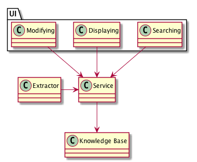
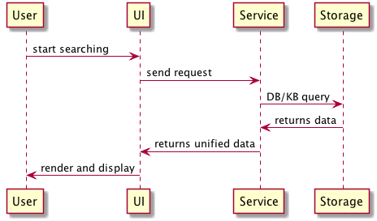

# Executive Summary

---

# Introduction

## Overview

This system is an assisting service of knowledge extraction, aggregation, searching, and visualization . The ultimate goal of this system is to help people like to access and learn knowledge they want more efficiently. For example, a university student can use this system help their study by searching and exploring the concepts and theories relating to their study, or a researcher starting his/her research in a new area can use this system to get a quick and comprehensive understanding of the basis, methodologies, and state-of-art of the that area.  

## Motivation

We are living in a data explosion time. We have numerous and rapid-growing amount of data every second, which, however, makes it more difficult than before to extract useful information from it, and even more to acquire real knowledge. For example, when someone gets started to do research on a new topic (that happens all the time), first s/he need to get familiar with the basic concepts in that topic, how its position in a bigger background, and how it is related to or different from other concepts. To do this, the researcher usually collects surveys in this topic or simply go to the Wikipedia page as a quick start. However, the researcher needs to go through many articles s/he gathered, select important parts and key concepts, and form a mental representation in the brain. So, what if we can do something better? What if we can create a system which helps in knowledge collecting, aggregating, and presenting in a more structured, intuitive and easier-to-understand way? This will help the researcher shorten the boarding time, and get more comprehensive catching to a new area.

# Architectural drivers

## Business goals and constraints

> what value would this system add to a company/business/community/government? Note any business considerations and constraints.

This system will add values to anyone who search or learning new knowledge, mostly academic community such as tertiary students, researchers, or practitioners. Since it is for academic community, it is preferably open to everyone, free to use, and low cost. 

## Technical goals, assumptions and constraints

> any technical decisions and assumptions that will not change throughout the project should be explained and justified in this section.

There are important constraints in technical respect, which is mainly caused by the huge amount, complex nature of knowledge and the immaturity of current knowledge representation and artificial intelligence algorithms.

- The first constraint comes from the complex nature of knowledge and the lack of universal representation method suitable for all kinds of knowledge and requirements from different knowledge consumers. Therefore, there are constraints on the knowledge representation and displaying:

  + The system should not only incorporate one representation, but has to be capable to handle a range of representations, and is better to take into account future changes.
  + The system should show knowledge in different views, that is, should support multiple views and visualization methods, switching between and combination of these views.

- The second constraint is the huge volume of knowledge. Therefore, knowledge gathering and extracting processes are highly preferable to be automatic. Thus comes the following constrains: 
    
  + The system should be capable to adopt AI algorithms to do these task
  + There is no universal algorithms for knowledge extraction so this system should be able to handle a variety of knowledge extraction algorithms, and better to take into account future improvements or upgrades
  + AI algorithms such as deep learning models are easy error-prone so the system should provide the features for manual correction of mistakes.

## Primary functional requirements

> What system features require explicit support from or can impact on its architecture? Explain how you identified these.

The primary features of this system will be as follows:

- Gathering and extraction: the system will gather, extract and structure knowledge from a variety of sources mainly text or semi-structured data, for example, Wikipedia

- Persistency: the system should persistent the acquired knowledge in certain representation for querying and exploration
  
- Displaying: show knowledge in more intuitive, fast-and easy-reading ways

- Searching: query for desired concepts with related concepts

## Quality attributes

> Explain the most important quality attributes for the system, along with the process you followed to identify and prioritize them.

### Stakeholder's concerns

- Users: a) The system should be easy to use and intuitive. b) Users should be able to correct errors introduced by automatic knowledge extraction algorithms

- Developers
  + System developer: The system should be highly decoupled from specific knowledge representation/extraction/visualization algorithms so upgrade on any of these modules won't break the whole system
  + Algorithmic developer/knowledge engineer: The system should be flexible and extensible so that improving, upgrading and replacing algorithms is simple and won't affect other modules.

- Operator: The system should be maintained in low cost

### Quality attribute scenarios

#### QAS 1: Usability

When a user start to do searching and understanding the search result, the usage should be intuitive and requires minimal learning cost.

- Stimulus: A user try to use the system
- Environment: The service is running
- Response:  return and render search result in intuitive form
- Response measure: cost for a new user to learn the usage of the system.

#### QAS 2: Modularity

A developer may improve or introduce a new knowledge representation or AI algorithm for knowledge extraction or visualization method because he find a new one. Therefore the system should be highly modular and decoupled so each module can be modified without affecting others.

- Stimulus: better algorithms/methods are discovered and preferable to replace the new one. 
- Environment: Development time, runtime
- Response: new methods are successfully created and integrated into the service
- Response measure: other parts of the service are not affected and require no modification.

#### QAS 3: Performance - Resource Utilization

As the system should be running in low cost so it might make use of resources very efficiently.

- Stimulus: operation of the system
- Environment: Runtime
- Response: the resources required by running the service are satisfied
- Response measure: the cost of operation of system

#### QAS 4: Performance - Scalability

Since new knowledge will be continuously added into the system's knowledge base so the system should be able to scaled.

- Stimulus: new data come into knowledge base
- Environment: Runtime
- Response: system are scaled to handle new data
- Response measure: the time of scaling

## Evaluation criteria

Explain how you will evaluate an architecture based on the drivers identified in sections 2-5.

---

# Views

> logical/process/physical/development/

## Logical View

1. Primary presentation

2. Element catalog

> explain each box & line

- Elements
  + Storage
  + Service
  + Extraction
  + UI
    - Searching
    - Displaying
    - Modifying
 
- Relations
  + Extraction -> Service
  + Service -> Storage
  + UI -> Service

- Element interfaces
- Element behavior

1. Context diagram

2. Variability guide

3. Architecture background
  - Rationale
  - Analysis results
  - Assumptions

6. Other information

7. Related view packets

## Process View

1. Primary presentation

> box & line - try to use UML

2. Element catalog

> explain each box & line

  - Elements and their properties
  - Relations
  - Element interfaces
  - Element behavior

3. Context diagram

4. Variability guide

5. Architecture background
  - Rationale
  - Analysis results
  - Assumptions

6. Other information

7. Related view packets

## Physical View

1. Primary presentation

> box & line - try to use UML

2. Element catalog

> explain each box & line

  - Elements and their properties
  - Relations
  - Element interfaces
  - Element behavior

3. Context diagram

4. Variability guide

5. Architecture background
  - Rationale
  - Analysis results
  - Assumptions

6. Other information

7. Related view packets
