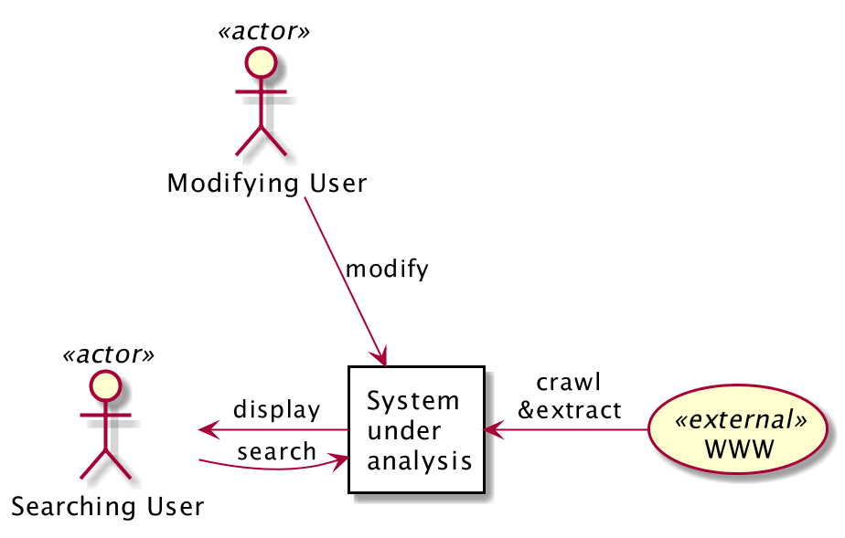

# Introduction

## System Overview

This system is aiming for a set of services of knowledge collection, extraction, aggregation, searching, and visualization. The ultimate goal of this system is to help people to access and acquire knowledge they want more efficiently. For example, a university student can use this system to help their study by searching and exploring the concepts and theories relating to their study. Another example could be that a researcher starting his/her research in a new area can use this system to get a quick and comprehensive understanding of the basis, methodologies, and state-of-art of the that area.

In order to achieve this, the system will have these features:

- automatic knowledge extraction
- knowledge representation
- persistance and storage
- UI for searching and exploration
- knowledge displaying and visualization

## Motivation & Purpose

We are living in a data explosion time. We have numerous and rapid-growing amount of data every second, which, however, makes it more difficult than before to extract useful information from it, and even more to acquire real knowledge [@Allahyari:2017:text_mining_survey] [@Lupiani-Ruiz:2011:Financial_semantic_search]. For example, as a common case, when someone gets started to do research on a new topic, first s/he need to get familiar with the basic concepts in that topic, how its position in a bigger background, and how it is related to or different from other concepts. To do this, researchers usually collect surveys in this topic or simply go to the Wikipedia page as a quick start. However, the researcher needs to go through many articles s/he gathered, select important parts and key concepts, and form a mental representation in the brain. [@beel2016:paper_recommender] Based on such consideration, it would be better and faster to understand if we can create a system which helps in knowledge collecting, aggregating [@zhao:2017:kg], and presenting in a more structured, intuitive and easier-to-understand way [@liu2018scholar_data_visualization]. This will help the researcher shorten the boarding time, and get more comprehensive catching to a new area.

## Related Work

Many efforts have already been contributed to target at this problem. Semantic Web makes meanings from wide spread heterogeneous information and data and thus provides more accurate answer for user query and enables more efficient acquisition of knowledge [@lei:2006:semsearch] [@Lupiani-Ruiz:2011:Financial_semantic_search]. However, this kind of technology focuses on making semantic meanings of web data to improve the traditional text search engine, but not incorporate data visualization method to represent the meanings or knowledge in the data. 

Knowledge Graph, as an emerging technology recently, which extracts and integrates knowledge from massive unstructured data and represents them in entity-relation triples, is widely used to improve a variety of applications such as search engines and recommendation systems [@zhao:2017:kg]. The limitation of Knowledge Graph is that knowledge is only represented in the form of graph. 

Some other approaches focusing on specific area were also studies. In academic area, scholar paper recommendation system is studied as a method to decrease information overload [@beel2016:paper_recommender] [@beel:2017:mr_dlib], while a comprehensive overview of scholarly data visualization was given by [@liu2018scholar_data_visualization]. However, the recommender usually works in level of documents. In Computer Science and Software Engineering area, researchers contributed to searching algorithms and/or systems for algorithms [@tuarob:2016:algorithm_search], software components [@garcia:2006:component_search] and design patterns [@AMPATZOGLOU:2013:design_pattern], which are task specific search engines instead of for general knowledge. 

## Methodology

In this article, the attribute-driven design (ADD) method [@Bass:2012:SA_in_practice] is followed. In section [@sec:arch_drv], a list of both functional and quality attributes (QA) requirements are identified from comprehensive analysis of business goals, technical constraints and/or stakeholders' concerns. The QAs identification is based on the product quality model in [@isoiec25010]. In section [@sec:views], three views are formulated based on the architectural drivers with detailed documentation and explanation. UML diagrams [@Cook2017:uml] are used to describe the architectural views.

# Architectural drivers {#sec:arch_drv}

## Business Goals and Constraints

This system will add values to anyone who search or learning new knowledge, mostly academic community such as tertiary students, researchers, or practitioners. Since it is for academic community, it is preferably open to everyone [@molloy:2011:open_knowledge], free to use, and low cost. 

## Technical Goals, Assumptions and Constraints

There are important constraints in technical respect, which are mainly caused by the huge amount, complex nature of knowledge and the immaturity of current knowledge representation and artificial intelligence algorithms [@Allahyari:2017:text_mining_survey].

- The first constraint comes from the complex nature of knowledge and the lack of universal representation method suitable for all kinds of knowledge and requirements from different knowledge consumers [@RISTOSKI:2016:semantic_web_survey]. Therefore, there are constraints on the knowledge representation and displaying:

  + The system should not only incorporate one representation, but has to be capable to handle a range of representations, and is better to take into account future changes.
  + The system should show knowledge in different views, that is, should support multiple views and visualization methods, switching between and combination of these views [@liu2018scholar_data_visualization].

- The second constraint is the huge volume of knowledge. Therefore, knowledge gathering and extracting processes are highly desired to be automatic [@Allahyari:2017:text_mining_survey]. Thus comes the following constraints: 
  
  + The system should be capable to adopt AI algorithms to do these task
  + There is no universal algorithms for knowledge extraction so this system should be able to handle a variety of knowledge extraction algorithms, and better to take into account future improvements or upgrades. In [@beel:2017:mr_dlib], the architecture of a recommendation-as-a-service platform was designed to be open to third-party recommendation algorithm researchers.
  + AI algorithms such as deep learning models are easily error-prone, so the system should provide the features for manual correction of mistakes.

## Primary Functional Requirements

The primary features of this system will be as follows:

- Gathering and extraction: the system will gather, extract and structure knowledge from a variety of sources mainly text or semi-structured data, for example, Wikipedia.

- Persistency: the system should persistent the acquired knowledge in certain representation for querying and exploration.
  
- Displaying: show knowledge in more intuitive, fast-and easy-reading ways.

- Searching: query for desired concepts with related concepts.

## Quality Attributes

### Stakeholder's Concerns

The proposed system has three main kinds of stakeholders and the following general functionality:

- Users: a) The system should be easy to use and intuitive; b) Users should be able to correct errors introduced by automatic knowledge extraction algorithms.

- Developers
  + System developer: The system should be highly decoupled from specific knowledge representation/extraction/visualization algorithms so upgrade on any of these modules won't break the whole system.
  + Algorithmic developer/knowledge engineer: The system should be flexible and extensible so that improving, upgrading, and replacing algorithms is simple and won't affect other modules.

- Operator: The system should be maintained in low cost

### Quality Attribute Scenarios

#### QAS 1: Modularity

The knowledge representation part, automatic knowledge extraction part, and visualization/rendering/displaying part may be responsible for different developers so they should be highly decoupled, isolated, and independently changeable.

- Stimulus: different kinds of developers work on different modules
- Environment: development time, maintenance time
- Response: modules of the system and contract between modules
- Response measure: degree of decoupling and dependency of all modules of the system.

#### QAS 2: Modifiability

A developer may improve or introduce a new knowledge representation or AI algorithm for knowledge extraction or visualization method because he find a new one. Therefore, the system should be highly modular and decoupled so each module can be modified without affecting others.

- Stimulus: better algorithms/methods are discovered and will replace the old ones. 
- Environment: development time, runtime
- Response: new methods are successfully created and integrated into the service
- Response measure: degree of the defects or quality degrading introduced by modification.

#### QAS 3: Performance - Resource Utilization

As the system should be running in low cost, it have to make use of resources very efficiently.

- Stimulus: operation of the system
- Environment: runtime
- Response: the resources required by running the service are satisfied
- Response measure: the cost of operation of system

#### QAS 4: Scalability

Since new knowledge will be continuously added into the system's knowledge base so the system should be able to scaled.

- Stimulus: new data come into knowledge base
- Environment: runtime, operation time
- Response: system are scaled to handle new data
- Response measure: the time of scaling

### Priority of QAs

Based on our business/technical goals and the QA scenarios described above, these QAs are prioritized from highest to lowest as follows

1. Modularity
2. Modifiability
3. Scalability
4. Resource Utilization

## Evaluation Criteria

The architecture will be evaluated based on the drivers identified in above sections.

### Modularity

Modularity will be evaluated by:

- the degree of decoupling and isolation of modules; higher is better
- the overall dependencies between modules; lower is better 

### Modifiability

Modifiability will be evaluated by:

- the impact or effort required on other components of the system to modify one module; lower is better

### Scalability

Scalability will be evaluated by:

- the effort to scale out the system in order to handle larger size of data and amount of traffic; lower is better

### Resource Utilization

Resource utilization will be evaluated by:

- the resources required by the architecture given the size of data and number of requests per second; lower is better

# Views {#sec:views}

In this section, threw views are described following the "4+1 view" model [@kruchten:1995:4plus1view], including:

- Logical view
- Process view
- Development view

Each view is presented in UML diagram and justified according to the architectural drivers and quality attributes analyzed in section [@sec:arch_drv].

## Logical View

### Primary Presentation

{ width=460px }

### Element Catalog

#### Elements

- Storage: store extracted knowledge
- Service: provide unified interface for accessing knowledge representation.
- Extractor: automatic knowledge extraction process enabled by machine learning algorithms
- UI
  - Searching: user search certain concepts
  - Displaying: easy-reading, intuitive display of searched and related concepts, preferably in visual ways
  - Modifying: user modify knowledge in the storage to correct errors introduced by automatic algorithms

#### Relations

- Extractor and Service
  + the automatic Extractor will generate new content of knowledge and write into Storage through unified Service.
  + Extractor may read existing knowledge to improve its performance according to the AI algorithms

- Service and Storage: Storage will not interact with other parts directly. Service will act as an abstract layer to isolate the storage and other parts.

- UI and Service: UI interacts with end user and convert user searching/modifying/browsing into requests to server and display data accordingly.

### Context Diagram {#sec:logical-view-context}

{ width=320px float="center" }

### Architecture Background

#### Rationale

As modularity is at the highest priority, the Service module is introduced as an adaptor and isolation layer to keep the knowledge storage base isolated from the Extractor and UI parts. The knowledge representation stored in database and AI algorithms for knowledge extraction are decoupled so that they can change independently. 

#### Other Systems Explored

[@zhao:2017:kg] proposed a system harvesting webpages and build domain specific knowledge graph from them by intensively using machine learning and text mining approaches such as SVM, POS Tagging, dependency parsing. Though this paper mainly focus on the algorithmic aspect of the system, it is a valuable reference on how we can accommodate various processing modules. 

## Process View

### Primary Presentation

  

### Element Catalog

#### Elements and Their Properties

- AI Extractor Node: Nodes running AI algorithms for crawling the web and extract knowledge.
- UI/Client Node: User interface for user to search, browse and modify.
- RESTful Service Node.
- Representation service Node: searching and get definition of knowledge representation
- Storage Node: service node with database and storage abstraction.
- Crawl web: read web data as knowledge source.
- Extract: extract knowledge from raw data with AI algorithms.
- Search: user start to search.
- User query mapping: map user query to knowledge representation and queries.
- Representation query mapping: map representation and mapping into physical storage format and query.
- Representation result mapping: map from physical storage format into knowledge representation.

#### Relations

- UI/Client Node and RESTful service Node: UI will convert user operations to requests to RESTful service.
- RESTful Service Node and Representation Service Node: the former acts as an wrapping and isolation layer of the latter. 
- Representation Service Node and Storage Node: abstract representation will be mapped to physical storage by DB querying.

### Context Diagram

{ width=300px }

### Architecture Background

#### Rationale

Each part of UI, Representation Service and Storage are designed as independent processes so that they can be developed and deployed to different physical machines or cloud computing instance thus reach resource efficiency.

All data is stored in Storage Nodes and other services are stateless so the system can be scaled out by increasing the running instance of services.

## Development View

### Primary Presentation

  

### Element Catalog

#### Elements and Their Properties

- Storage
  + NoSql DB & Graph DB: database storage with these two used for demonstrating the concept. 
  + DB Engines: data access layers for corresponding databases.
  + Storage API: unified API service for knowledge storage, abstract from concrete database.
  + Storage Version Control: management of different storage scheme to handle co-existence and compatibility when changes/upgrade need to be made.

- Representation
  + Representation Definition: definition of knowledge representation, maybe use JSON or XML format.
  + Representation Abstraction: representation abstraction from physical storage format
  + Storage Mapping: map from logical representation to physical representation supported by Storage module.
  + Representation Version Control: management of different knowledge representation scheme to handle co-existence and compatibility.

- Service
  + Representation Adaptor: adaption layer as an isolation between RESTful API and representation module.
  + RESTful API: provide unified service for both automatic extractor and UI.

- UI
  - Client: an HTTP client interacting with service
  - Searching: knowledge searching UI and functionality
  - Modifying: UI and functionality for user to modify contents in knowledge storage for error correction.
  - Displaying: knowledge displaying, visualization and rendering.

- Extractor
  - Crawler: crawls the web and collect contents as the source of knowledge.
  - AI Algorithms: automatic knowledge extraction algorithms which may need to read existing knowledge for better performance.
  - Format Adapter: adaption layer to transform the format of results from AI algorithms to fit the unified service.

- Data Exchange Contract modules:
  - Storage Contract: contract between storage module and representation module.
  - Service API Contract: contract between UI and knowledge service.

#### Relations

- Storage, Representation and Storage Contract: the storage module and representation module are loosely coupled by introducing the storage contract for data exchange. The two modules can be modified independently as long as the keep consistent to the contract.
- Representation Abstraction, Service and Representation Definition: the service will interact with representation module, and representation module will manage different representations to provide abstracted functionality transparent to lower level details.
- UI, Service and Service API Contract:  the UI and service are decoupled by the service API contract.

### Context Diagram

{ width=500px }

### Variability Guide

1. MongoDB and Neo4j are shown in the diagram but in design the system should be flexible to be plugged with and abstracted from other kinds of databases.

2. Other kind of services may be used instead of RESTful APIs. For example, GraphQL can be introduced into the system if it is found to be more suitable in some cases.

### Architecture Background

#### Rationale

The development of the system is divided into several packages. The UI and backend Service interacts data with Service API Contract. The Service and Representation exchange data by Representation Definition. The Representation and physical Storage exchange data by Storage API Contract. These packages can be developed, modified and tested separately, thus increases modularity and modifiability.

#### Other Systems Explored

In [@kruchten:1995:4plus1view] the authors described the architecture of a scholarly recommendation system. It use rational database, MySQL, as primary storage. However, in our case, NoSQL or Graph DB are more suitable because our data structure would be more diverse, complex and flexible. In terms of the implementation of search engine, this paper incorporates Apache Solr/Lucene. This is also a good choice for our system, but the modularity, abstraction and isolation should be taken into account.

# Conclusion and Future Work

As the posts on the web as well as academic publications are increasing exponentially, it can effectively reduce the cost of acquiring information and learning new knowledge with a system helping users access related articles and read them easily. This article proposed the architecture of an knowledge assist system  collecting, extracting, aggregating, searching and exploring knowledge aiming to help people acquire and learn knowledge more efficiently. The ADD methodology is followed to create the architecture. First, the architecture drivers are presented and analyzed. Second, three views are demonstrated, namely logical view, process view and development view.

There are some aspects of the system not covered and can improve the architecture design further:

- Deployment view and use case scenarios are not covered, but they are also useful for demonstrating some quality attributes such as scalability, performance, usability [@kruchten:1995:4plus1view].
- The core part of the system can be refined. Since the primary QA are modularity, the decomposition, decoupling, abstraction and isolation of components need to be analyzed into more detail and carefully examined [@AMPATZOGLOU:2013:design_pattern].
- Algorithm/representation evaluation and selection system can be introduced for choosing among different AI extraction algorithms, knowledge representations and visualization methods. For example, an A/B testing system can be used for evaluation [@beel:2017:mr_dlib]. Selection can work in a manual way or automatically by machine learning algorithms.

\pagebreak