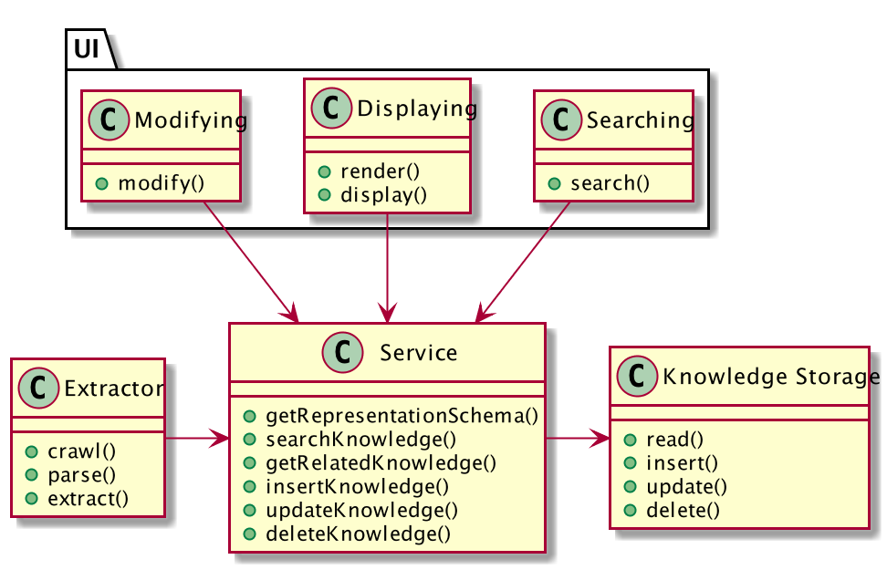

# Executive Summary

---

# Introduction

## System Overview

This system is an assisting service of knowledge extraction, aggregation, searching, and visualization . The ultimate goal of this system is to help people like to access and learn knowledge they want more efficiently. For example, a university student can use this system help their study by searching and exploring the concepts and theories relating to their study, or a researcher starting his/her research in a new area can use this system to get a quick and comprehensive understanding of the basis, methodologies, and state-of-art of the that area.  

## Motivation & Purpose

We are living in a data explosion time. We have numerous and rapid-growing amount of data every second, which, however, makes it more difficult than before to extract useful information from it, and even more to acquire real knowledge. For example, when someone gets started to do research on a new topic (that happens all the time), first s/he need to get familiar with the basic concepts in that topic, how its position in a bigger background, and how it is related to or different from other concepts. To do this, the researcher usually collects surveys in this topic or simply go to the Wikipedia page as a quick start. However, the researcher needs to go through many articles s/he gathered, select important parts and key concepts, and form a mental representation in the brain. Based on such consideration, it would be better and faster to understand if we can create a system which helps in knowledge collecting, aggregating, and presenting in a more structured, intuitive and easier-to-understand way. This will help the researcher shorten the boarding time, and get more comprehensive catching to a new area.

## Process for creating the architecture (like ADD)

## Organizational context

# Architectural drivers

## Business goals and constraints

> what value would this system add to a company/business/community/government? Note any business considerations and constraints.

This system will add values to anyone who search or learning new knowledge, mostly academic community such as tertiary students, researchers, or practitioners. Since it is for academic community, it is preferably open to everyone, free to use, and low cost. 

## Technical goals, assumptions and constraints

> any technical decisions and assumptions that will not change throughout the project should be explained and justified in this section.

There are important constraints in technical respect, which is mainly caused by the huge amount, complex nature of knowledge and the immaturity of current knowledge representation and artificial intelligence algorithms.

- The first constraint comes from the complex nature of knowledge and the lack of universal representation method suitable for all kinds of knowledge and requirements from different knowledge consumers. Therefore, there are constraints on the knowledge representation and displaying:

  + The system should not only incorporate one representation, but has to be capable to handle a range of representations, and is better to take into account future changes.
  + The system should show knowledge in different views, that is, should support multiple views and visualization methods, switching between and combination of these views.

- The second constraint is the huge volume of knowledge. Therefore, knowledge gathering and extracting processes are highly preferable to be automatic. Thus comes the following constrains: 
    
  + The system should be capable to adopt AI algorithms to do these task
  + There is no universal algorithms for knowledge extraction so this system should be able to handle a variety of knowledge extraction algorithms, and better to take into account future improvements or upgrades
  + AI algorithms such as deep learning models are easy error-prone so the system should provide the features for manual correction of mistakes.

## Primary functional requirements

> What system features require explicit support from or can impact on its architecture? Explain how you identified these.

The primary features of this system will be as follows:

- Gathering and extraction: the system will gather, extract and structure knowledge from a variety of sources mainly text or semi-structured data, for example, Wikipedia

- Persistency: the system should persistent the acquired knowledge in certain representation for querying and exploration
  
- Displaying: show knowledge in more intuitive, fast-and easy-reading ways

- Searching: query for desired concepts with related concepts

## Quality attributes

> Explain the most important quality attributes for the system, along with the process you followed to identify and prioritize them.

### Stakeholder's concerns

- Users: a) The system should be easy to use and intuitive. b) Users should be able to correct errors introduced by automatic knowledge extraction algorithms

- Developers
  + System developer: The system should be highly decoupled from specific knowledge representation/extraction/visualization algorithms so upgrade on any of these modules won't break the whole system
  + Algorithmic developer/knowledge engineer: The system should be flexible and extensible so that improving, upgrading and replacing algorithms is simple and won't affect other modules.

- Operator: The system should be maintained in low cost

### Quality attribute scenarios

#### QAS 1: Modularity

The knowledge representation part, automatic knowledge extraction part, and visualization/rendering/displaying part may be responsible for different developers so they should be highly decoupled and isolated and can be changed independently.

- Stimulus: different kinds of developers work on different modules
- Environment: development time, maintenance time
- Response: modules of the system and contract between modules
- Response measure: degree of decoupling and dependency of all modules of the system.

#### QAS 2: Modifiability

A developer may improve or introduce a new knowledge representation or AI algorithm for knowledge extraction or visualization method because he find a new one. Therefore the system should be highly modular and decoupled so each module can be modified without affecting others.

- Stimulus: better algorithms/methods are discovered and will replace the old ones. 
- Environment: Development time, runtime
- Response: new methods are successfully created and integrated into the service
- Response measure: degree of the defects or quality degrading introduced by modification.

#### QAS 3: Performance - Resource Utilization

As the system should be running in low cost so it might make use of resources very efficiently.

- Stimulus: operation of the system
- Environment: Runtime
- Response: the resources required by running the service are satisfied
- Response measure: the cost of operation of system

#### QAS 4: Scalability

Since new knowledge will be continuously added into the system's knowledge base so the system should be able to scaled.

- Stimulus: new data come into knowledge base
- Environment: Runtime
- Response: system are scaled to handle new data
- Response measure: the time of scaling

### Priority of QAs

Based on our business/technical goals and the QA scenarios described above, these QAs are prioritized from highest to lowest as follows

1. Modularity
2. Modifiability
3. Scalability
4. Resource Utilization

## Evaluation criteria

The architecture will be evaluated based on the drivers identified in above sections.

### Modularity

Modularity will be evaluated by:

- the degree of decoupling and isolation of modules, higher is better
- the overall dependencies between modules, lower is better 

### Modifiability

Modifiability will be evaluated by:

- the impact or effort required on other components of the system to modify one module, lower is better

### Scalability

Scalability will be evaluated by:

- the effort to scale out the system in order to handle larger size of data and amount of traffic, lower is better

### Resource Utilization

Resource Utilization will be evaluated by:

- the resources required by the architecture given the size of data and number of requests per second, lower is better

# Views

## Logical View

### Primary presentation

### Element catalog

#### Elements

- Storage: store extracted knowledge
- Service: provide unified interface for accessing knowledge representation.
- Extractor: automatic knowledge extraction process enabled by machine learning algorithms
- UI
  - Searching: user search certain concepts
  - Displaying: easy-reading, intuitive display of searched and related concepts, preferably in visual ways
  - Modifying: user modify knowledge in the storage to correct errors introduced by automatic algorithms

#### Relations

- Extractor and Service
  + the automatic Extractor will generate new content of knowledge and write into Storage through unified Service.
  + Extractor may read existing knowledge to improve its performance according to the AI algorithms

- Service and Storage: Storage will not interact with other parts directly. Service will act as an abstract layer to isolate the storage and other parts.

- UI and Service: UI interacts with end user and convert user searching/modifying/browsing into requests to server and display data accordingly.

### Context diagram {#sec:logical-view-context}

### Variability guide

### Architecture background

#### Rationale

As modularity is at the highest priority, the Service module is introduced as an adaptor and isolation layer to keep the knowledge storage base isolated from the Extractor and UI parts. The knowledge representation stored in database and AI algorithms for knowledge extraction are decoupled so that they can change independently. 

#### Analysis results

#### Assumptions

## Process View

### Primary presentation

  

### Element catalog

#### Elements and their properties

- AI Extractor Node: Nodes running AI algorithms for crawling the web and extract knowledge
- UI/Client Node: User interface for user to search, browse and modify
- RESTful Service Node
- Representation service Node: searching and get definition of knowledge representation
- Storage Node: service node with database and storage abstraction
- Crawl web: read web data as knowledge source
- Extract: extract knowledge from raw data with AI algorithms
- Search: user start to search
- User query mapping: map user query to knowledge representation and queries
- Representation query mapping: map representation and mapping into physical storage format and query
- Representation result mapping: map from physical storage format into knowledge representation

#### Relations

- UI/Client Node and RESTful service Node: UI will convert user operations to requests to RESTful service
- RESTful Service Node and Representation Service Node: the former acts as an wrapping and isolation layer of the latter. 
- Representation Service Node and Storage Node: abstract representation will be mapped to physical storage by DB querying

### Context diagram

### Variability guide

### Architecture background

#### Rationale

Each part of UI, Representation Service and Storage are designed as independent process so that they can be developed and deployed to different physical machines or cloud computing instance thus reach resource efficiency.

All data is store in Storage Nodes and other services are stateless so the system can be scaled out by increasing the running instance of services.

#### Analysis results
#### Assumptions

## Development View

### Primary presentation

  

### Element catalog

#### Elements and their properties

- Storage
  + MongoDB
  + MongoDB Engine
  + Neo4j
  + Neo4j Engine
  + Storage API
  + Storage Version Control

- Representation
  + Representation Definition
  + Representation Abstraction
  + Storage Mapping
  + Representation Version Control

- Service
  + Representation Adaptor
  + RESTful API

- UI
  - Client
  - Searching
  - Modifying
  - Displaying

- Storage Contract

- Service API Contract

#### Relations

- Storage, Representation and Storage Contract
- Representation Abstraction, Service and Representation Definition
- UI, Service and Service API Contract

#### Element interfaces
#### Element behavior

### Context diagram

### Variability guide

### Architecture background

#### Rationale

The development of the system is divided into several packages. The UI and backend Service interacts data with Service API Contract. The Service and Representation exchange data by Representation Definition. The Representation and physical Storage exchange data by Storage API Contract. These packages can be developed and tested separately. Each package can be deployed independently so that we can make the resource usage maximized and scale out different parts on demand.

#### Analysis results

#### Assumptions

### Other information

### Related view packets
