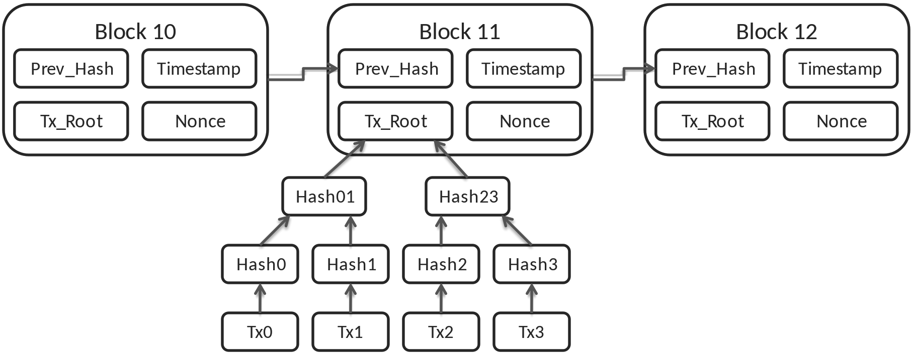

# Summary

> A summary sheet should briefly present the most important findings for each area of the report as a summary. Summary diagrams are a good idea.

Blockchain is an emerging and fast-developing technology revolutionizing our world. In this report, we analyzed this technology in a variety of different views from basic ideas to challenges to future impacts. The main findings in this report are summarized as follows:

1. The basic concepts, purpose and key values of blockchain and smart contract are comprehensively studied and briefly summarized. Blockchain is enabled by distributed ledger in which transactions are verified by each participant being stamped and hashing and consequently requires no immediate third party authority. Ethereum and smart contract expanded the use of blockchain by enabling the execution of arbitrary operation programmed in advance. 

2. The fundamental principle of the way blockchain works is explained in detail with an example of application in crypotcurrency transaction. The key point of blockchain is that it maintains a immutable, ever-growing list of blocks in which each is signatured according to the message, timestamp and hash of previous block. Adding a new block to the network is verified by all nodes in the network in a peer-to-peer way.

3. A range of libraries and tools for development of smart contracts, decentralized applications and other software over blockchain network are collected. Categorization and summarization are made. Existing development tools can include development tools and environment of smart contract and decentralized applications(dApps), blockchain as a service(Baas) platforms, blockchain storage and database, alternative blockchain platforms, and test tools for software over blockchain network.

4. Several challenges and shortcomings of blockchain is studied and analyzed, including scalability and performance such as throughput and latency, storage capacity for increasing amount of transaction data, security issues and vulnerability to attacks especially for smart contract, more efficient consensus mechanisms.

5. A case study is made about a research paper about using blockchain technology for car insurance. The system basically works as a blockchain application with interaction to sensors on a vehicle and a mobile app. Sensor data as well as photos of the vehicle will be appended to the blockchain network. With the mobile app, users can interact with the insurances plan, such as activating/deactivating insurance coverage. 

6. Several impacts of blockchain as well as future directions are described. Smart contract and dApps enable support for large-scale web applications without centralized management. Storage and database over blockchain is more transparent, more secure and cheaper than existing solutions. Furthermore, blockchain can also benefit software engineering itself. 

